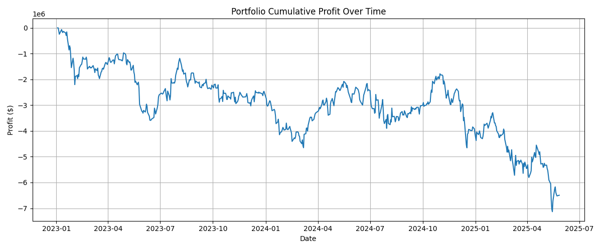
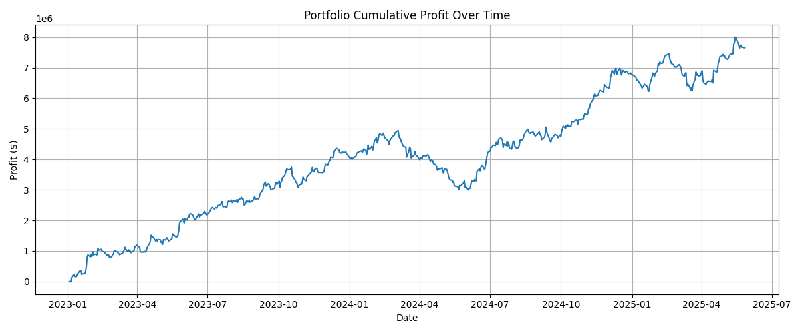

# FundGen:  DSL for Investment Portfolio Generation
People like to invest in the stock markets, but most of us lack the time and tools to conduct meaningful quantitative research. Can we make quant research accessible to everyone so we can even do research from home by ourselves?  
FundGen helps people without financial background to do generate profitable portfolio. If you want to: 
* invest according to historical data
* do backtesting and find best strategy
* do research automatically because you don't have finance background
* be cool
FundGen is for you!

---

## Quick Start
### Installation
Clone the repo and install dependency with the following commands:
```bash
git clone https://github.com/hsiang20/FundGen.git
cd FundGen
pip install -r requirements.txt
chmod +x run
```

### Hello Portfolio!
1. Create a file named `hello.fund`.
2. Implement a basic trading strategy. In this example, the trading strategy is:
> If the stock price is lower than its 10-day average, we buy the stock because we believe the price will rise. If the stock price is higher than its 10-day average, we short the stock because we believe the price will fall. 

Implement this strategy by writing in `hello.fund`:
```c
# Load price data
load(data=Close);
# Calculate the rolling average in 10 days periods
tsmean(out=price_avg, in=Close, days=10);
# Calculate the difference between the rolling average and the price
sub(out=diff, in1=price_avg, in2=Close);
# This is your portfolio. Return the portfolio and visualize profits
normalize(out=portfolio, in=diff);
stat portfolio;
```

3. Run the backtesting and generate the portfolio. 
```bash
./run hello.fund
```

4. You can view the strategy and the backtesting result in the terminal:
> Stats of the best strategy:
Sharpe: -0.922
Annual Returns Rate: -219.134%
Turnover Rate: 52.78%

The Sharpe ratio is very low and the annual returns rate is negative, meaning the risk of this strategy is very high and this strategy needs refinement to be used to trade. 

5. The cumulative profit is stored as `profit.png` in the `image` folder: 


6. If you want to use this strategy to trade, you can view `portfolio/portfolio.csv` to see your portfolio today. 

### Start Making Profits: Buffett's Strategy and PV Correlation
Most of us can't come up with a strategy ourselves. This is why FundGen DSL exists - even if we don't know how to invest, we can still generate a good strategy! In this part, we're going to explore more functions in Fundgen and use FundGen to search for a good strategy. 
#### How Buffett invests
From [this introduction](https://www.investopedia.com/articles/01/071801.asp) we know that Buffett's methodology includes: 
> 1. Company Performance (eg. return on equity)
> 2. Company Debt
> 3. Profit Margins
> 4. Commodity Reliance
> ......

But I don't know what they mean. So let's ask ChatGPT what data are related to these metrics. This is a part of the reply: 
> 1. Company Performance: Normalize and Clean Earnings (EBITDA, EBIT, Reconciled Depreciation)
> 2. Earnings Consistency (standard deviation of Net Income)
> 3. Profit Margin (Net Income / Total Revenue)
> ......

That's enough. Although we still don't know what these metrics mean, now it's FundGen's time to explore.

Open a new file `buffett.fund` and start coding!

#### Load Data
The first step is always loading data. We load all the data mentioned above as well as price/volume data. 
```c
load(data=Volume);
load(data=Close);
load(data=EBIT);
load(data="Reconciled Depreciation");
load(data="Net Income");
load(data="Normalized EBITDA");
load(data="Total Revenue");
```

#### Company Performance
From ChatGPT's reply, we know that EBITDA, EBIT, and Reconciled Depreciation are important in this strategy. Therefore, we want to add these numbers together. 
Directly adding these numbers is unfair because we don't know the units of them and their magnitude. A more general method is ranking them across assets, and then adding the ranked values. 
For Depreciation, we guess some companies don't have this entry on their statements. To prevent the NaN values affect the result, we can use `nanto0` to replace NaN with 0. 
```c
rank(out=EBIT_rank, in=EBIT);
rank(out=EBITDA_rank, in="Normalized EBITDA");
nanto0(out=Depreciation, in="Reconciled Depreciation");
rank(out=Depreciation_rank, in=Depreciation);
add(out=earnings, in1=EBIT_rank, in2=EBITDA_rank);
add(out=earnings, in1=earnings, in2=Depreciation_rank);
```
The variable `earnings` is the Company Performance we measure. 

#### Earnings Consistency
ChatGPT told us to calculate the standard deviation of the Net Income. Therefore we use `tsstd` to calculate the time-series standard deviation of the past 300 days. 300 is a random number we are trying, and we can replace it with other numbers. Here we also use `nanto0` to avoid NaN in our calculation. 
```c
tsstd(out=earnings_std, in="Net Income", days=300);
nanto0(out=earnings_std, in=earnings_std);
rank(out=earnings_std_rank, in=earnings_std);
```
The variable `earnings_std_rank` is the Earnings Consistency we measure. 

#### Profit Margin
According to ChatGPT's formula, we want to calculate `Net Income / Revenue`. We don't know the Revenue's range, but since it is a denominator, we don't want extreme values. Therefore we use `cap_floor` to limit the range of Revenue. 
```c
cap_floor(out=revenue_cap, in="Total Revenue", cap=100000, floor=100);
div(out=margin, in1="Net Income", in2=revenue_cap);
rank(out=margin_rank, in=margin);
```
The variable `margin_rank` is the Profit Margin we measure. 

#### Price / Volume Relation
The data we used above are fundamental. They update very slowly (at most 4 times a year). We want to mix the fundamental data signal with some faster signals so the portfolio reacts to short-term market fluctuation as well. Here we want to combine stock price and trading volume to create a signal. 

However, we don't know how to use price and volume. Fortunately, Fundgen provides a primitive `select` to simulate all combinations of given functions and return the best combination. `select(0)` will try all combinations and permutations of the given functions. `select(n)` with n != 0 will try all combinations and permutations of n of the given functions. 

For example, if we think that the correlation coefficient between price and volume could be meaningful, and the movement of the correlation coefficient could also be meaningful, we can write: 
```c
rank(out=volume_rank, in=Volume);
rank(out=close_rank, in=Close);
select(0) {
    tscorr(out=_, in1=Volume, in2=Close, days=40),
    tscorr(out=_, in1=Volume, in2=Close, days=30),
    tscorr(out=_, in1=Volume, in2=Close, days=20)
};
select(0) {
    tsrank(out=_, in=_, days=25),
    tsrank(out=_, in=_, days=15)
};
addconst(out=pv_corr_tsrank, in=_, c=0);
```
The variable `pv_corr_tsrank` is the Price / Volume Relation we measure (although we know nothing about it).

#### Ensemble all the signals
Finally, we add all the signals we generated above. We believe that Buffett's idea is better than ours (price/volume relation), so we multiply Buffett's signal by 5 before adding it to the unknown price/volume signal. 
```c
add(out=_, in1=earnings, in2=earnings_std_rank);
rank(out=_, in=_);
add(out=_, in1=_, in2=margin_rank);
rank(out=_, in=_);
mulconst(out=_, in=_, c=5);
add(out=_, in1=_, in2=pv_corr_tsrank);
```

#### Normalize
We want our portfolio to be independent of the overall market index. Moreover, we don't want extreme values to affect the portfolio. Using `normalize` here helps demean and reshape our portfolio. 
```c
normalize(out=portfolio, in=_);
```

#### Return
Finally, the variable `portfolio` is the portfolio we generate. We use `stat` to measure the performance. 
```c
stat portfolio;
```

#### Simulate
Run: 
```bash
./run buffett.fund
```
or directly run our example:
```bash
./run examples/buffett.fund
```
Since we use `select`, there are 60 cases to run. The program should output
> Sharpe: 2.09
Annual Returns Rate: 234.675%
Turnover Rate: 9.83%

With the best strategy specifying what strategy yields this performance. 

In `image` directory we can find the cumulative profits over two years:


This looks really good! 
For your information, Buffett's Berkshire Hathaway has realized a Sharpe ratio of 0.79. And we got 2.09 with our strategy, which means in terms of Sharpe ratio we beat Buffett!

Although in the real investment, we also need to consider turnover rate (related to transaction fee and liquidity), drop down (related to risk management), and other metrics, this example shows that FundGen provides a great platform for people without financial knowledge to generate portfolio which can potentially earn (a lot of) money. 

#### Invest
If you want to use this strategy, you can modify the date in `src/config.py` to simulate the most updated data and get the portfolio today. You can find the portfolio in `portfolio/portfolio.csv`: 
```
AAPL,44118.74
MSFT,45559.45
GOOGL,33557.3
AMZN,28225.54
NVDA,23120.65
...
```

---

## Supported Data
Data are fetched from yfinance dataset. 
### High-Frequency Data
High, Low, Close, Volume, Dividends

### Low-Frequency Data
'Tax Effect Of Unusual Items', 
'Tax Rate For Calcs',
'Normalized EBITDA',
'Net Income From Continuing Operation Net Minority Interest',
'Reconciled Depreciation', 
'Reconciled Cost Of Revenue', 
'EBITDA',
'EBIT', 
'Net Interest Income', 
'Interest Expense', 
'Interest Income',
'Normalized Income',
'Net Income From Continuing And Discontinued Operation',
'Total Expenses', 
'Total Operating Income As Reported',
'Diluted Average Shares', 
'Basic Average Shares',
'Diluted EPS',
'Basic EPS', 
'Diluted NI Availto Com Stockholders',
'Net Income Common Stockholders', 
'Net Income',
'Net Income Including Noncontrolling Interests',
'Net Income Continuous Operations', 
'Tax Provision', 
'Pretax Income',
'Other Income Expense', 
'Other Non Operating Income Expenses',
'Net Non Operating Interest Income Expense',
'Interest Expense Non Operating', 
'Interest Income Non Operating',
'Operating Income', 
'Operating Expense', 
'Research And Development',
'Selling General And Administration', 
'Gross Profit', 
'Cost Of Revenue',
'Total Revenue', 
'Operating Revenue'

---

## Primitives
* Data Pre-processing
```c
nanto0(out, in); # if data = nan, make it 0
cap_floor(out, in, cap, floor); # limit the range of in to [floor, cap]
```

* Scalar Computation
```c
add(out, in1, in2); # out = in1 + in2
sub(out, in1, in2); # out = in1 - in2
mul(out, in1, in2); # out = in1 * in2
div(out, in1, in2); # out = in1 / in2
addconst(out, in, c); # out = in1 + c, c is an integer
subconst(out, in, c); # out = in1 - c, c is an integer
mulconst(out, in, c); # out = in1 * c, c is an integer
divconst(out, in, c); # out = in1 / c, c is an integer
flip(out, in); # out = -in
abs(out, in); # out = |in|
power(out, in, c); # out = in ** c, c is an integer
```

* Asset-wise Operations
```c
rank(out, in); # rank asset-wise in each day. Data value will be 1, 2, ..., NUM_OF_ASSET
demean(out, in); # move the data so that mean of each day = 0
normalize(out, in) # move and scale the data so that mean = 0, std = 1 for each day
```

* Time-series Operations
```c
tsmean(out, in, days); # out = moving average of "in" for the past "days" days. days is an integer > 0. 
tsrank(out, in, days); # rank each asset among the past "days" days. Data value will be 1, 2, ..., days. days is an integer > 0.
tscorr(out, in1, in2, days); # correlation coefficient of in1 and in2 over the past "days" days. days is an integer > 0. 
tsstd(out, in, days); # standard deviation of "in" over the past "days" days. days is an integer > 0. 
```